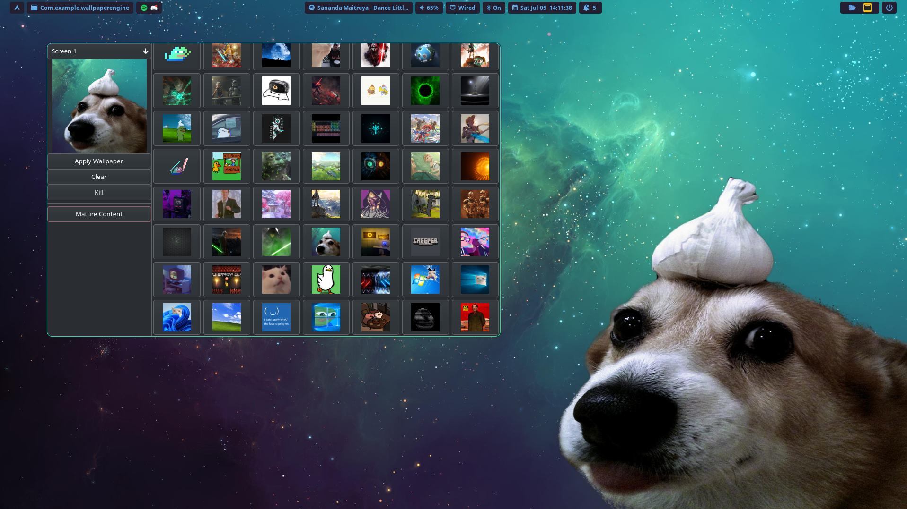

# Wallpaper Engine GTK Frontend

A GTK-based frontend for managing and applying wallpapers using [linux-wallpaperengine](https://github.com/Almamu/linux-wallpaperengine) on Linux.



## Features

- Browse and preview wallpapers from your Steam Workshop directory.
- Assign different wallpapers to different screens.
- Set framerate and engine path via configuration.
- CLI flags for automation (`--apply`, `--kill`, `--new-desktop`).

## Installation (arch based, debian based, fedora)
```sh
bash <(curl -fsSL https://raw.githubusercontent.com/Poellebob/wallpaper-engine-linux-gui/refs/heads/master/install.sh)
```
append `--devel` for the development channel

### Other Distributions / Manuel

Install the following dependencies manually:
- python3
- python3-gi
- python3-gobject
- GTK4
- GdkPixbuf
- wallpaperengine-linux (https://github.com/Almamu/linux-wallpaperengine)

Then run:
```sh
welg --new-desktop
```

If it says that welg is not a command consider adding `export PATH="$HOME/.config/bin:$PATH"` to your rc file

## Usage

1. Run the application:
    ```sh
    welg
    ```
2. Select a screen from the dropdown.
3. Click a wallpaper to assign it to the selected screen.
4. Click "Apply Wallpaper" to set wallpapers using linux-wallpaperengine.
5. Use "Kill" to stop all running wallpaperengine-linux processes.
6. Use "Clear" to remove the wallpaper assignment for the selected screen.

### CLI Flags

- `--apply` : Apply the selected wallpapers and exit (no GUI).
- `--kill` : Kill all running linux-wallpaperengine processes and exit.
- `--new-desktop` : Create or update the .desktop file for the application and exit.
- `--help` or `-h` : Show help message.

Example:
```sh
welg --apply
welg --kill
welg --new-desktop
```

### Hyprland (startup exaple)
Apply walpapers without starting the gui
```
exec-once = welg --apply 
```

## Desktop Integration

The install script (`install.sh`) will create a `.desktop` file in `~/.local/share/applications/wallpaperengine-linux.desktop` so you can launch the app from your applications menu.
